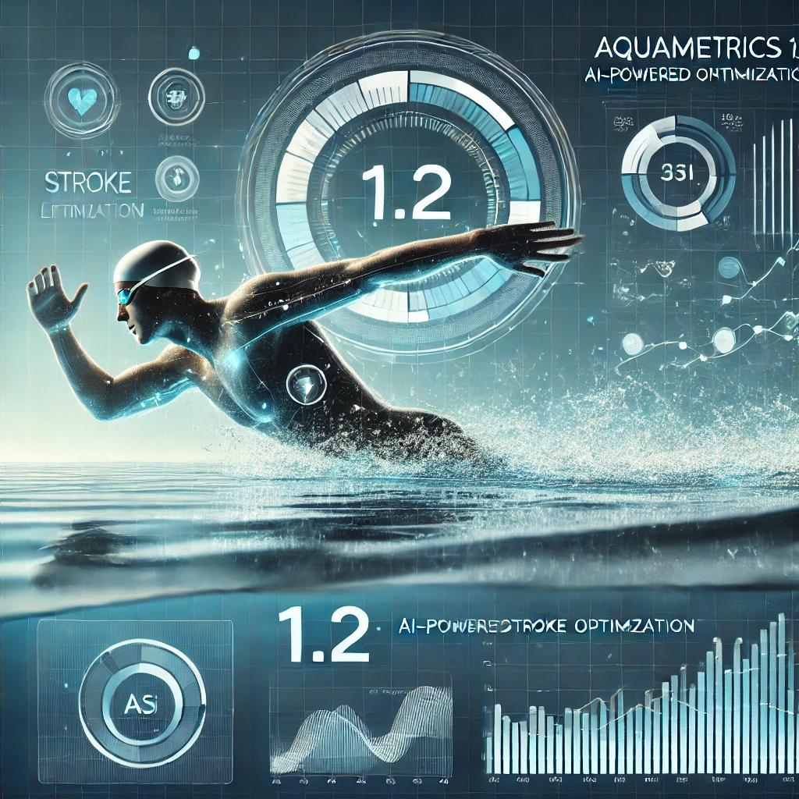

{ .img-fluid .mb-5 }

We’re thrilled to introduce Aquametrics 1.1.1: AI Precision, bringing cutting-edge AI-driven enhancements to stroke analysis and performance optimization. This update empowers swimmers, coaches, and analysts with smarter, more precise insights to refine techniques and maximize efficiency in the water.

🚀 What’s New?

🔹 AI-Powered Stroke Recognition – Automatically detects and classifies freestyle, backstroke, breaststroke, and butterfly with enhanced accuracy.

🔹 Real-Time Stroke Efficiency Scoring – AI now evaluates stroke mechanics, providing instant feedback on technique, timing, and efficiency.

🔹 Performance Optimization Suggestions – Personalized AI-driven recommendations to reduce drag, improve turns, and maximize propulsion.

🔹 Smart Fatigue Detection – Advanced motion tracking detects fatigue patterns, helping prevent overtraining and injury.

🔹 Enhanced Visualization & Data Insights – New interactive charts and real-time tracking for deeper performance analytics.

🌊 Why Upgrade?
With Aquametrics 1.2, you get smarter, AI-enhanced training insights designed to improve performance, prevent injuries, and optimize every swim like never before.

🔗 [Update Now] and take your swimming to the next level!

#SwimSmarter #AIForPerformance #Aquametrics12